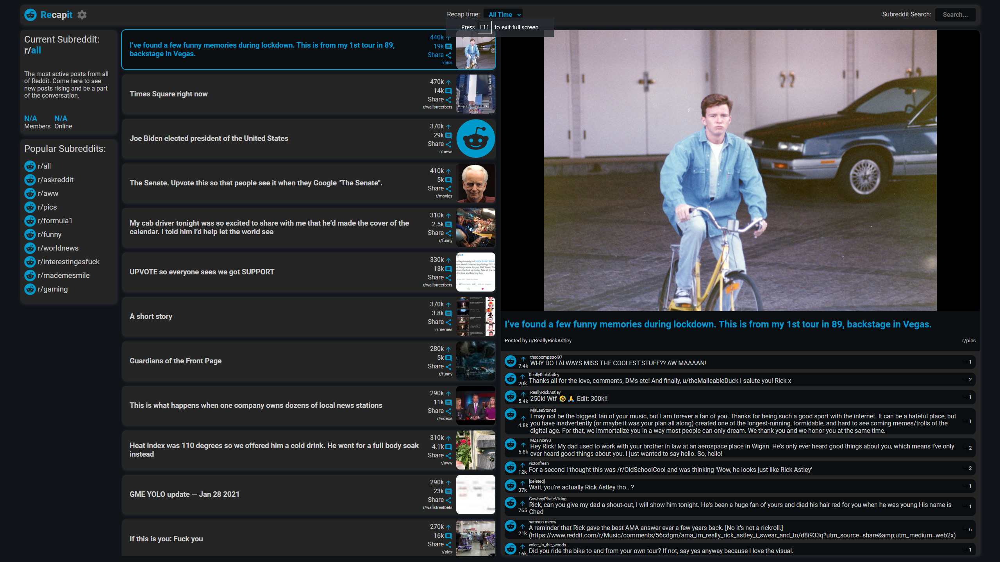
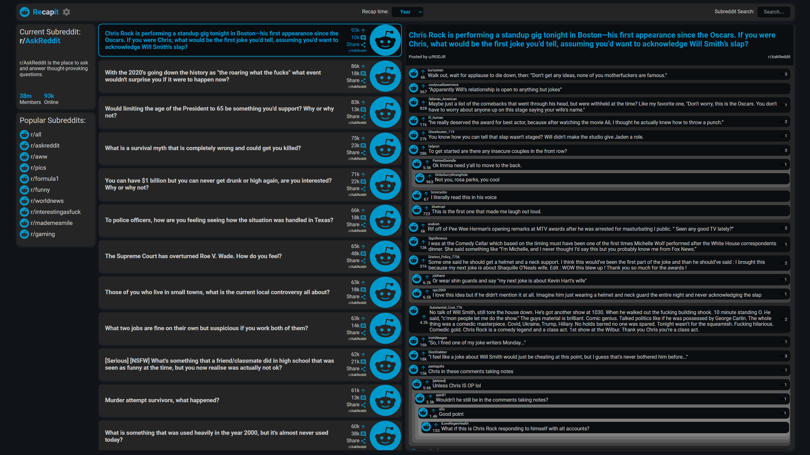

[](https://github.com/jongreen96/recapit-reddit-client)

# Simple, fast & intuitive

This is the repo for
[Recapit Reddit Client](https://github.com/jongreen96/recapit-reddit-client). All code is in this repository.

## Table of contents

-   [Table of contents](#table-of-contents)
-   [Introduction](#introduction)
-   [Codebase](#codebase)
    -   [Technologies](#technologies)
    -   [Folder structure](#folder-structure)
    -   [Code Style](#code-style)
-   [Setup Process](#setup-process)
-   [Acknowledgments](#acknowledgments)

# Introduction

This is a simplistic Reddit client that allows users to browse Reddit posts and comments. It is built with React and Redux, and uses the Reddit JSON API to fetch data. It is also a single page application that uses React Router to handle routing and is a responsive web application that is designed to work on mobile, tablet and desktop devices.

Recapit Reddit Client is a project that I have been working on to learn React and Redux. It is a work in progress and I will continue to add features and improve the codebase as I learn more about React and Redux. Features that I would like to add include:

-   Ability to interact with posts and comments (upvote, downvote, save, etc.)
-   Ability to search for posts and comments
-   Ability to view user profiles
-   Saving user preferences (e.g. dark mode, sorting, etc.)

# Codebase

## Technologies

Almost the entire codebase consists in **Javascript** & **CSS**

Here is a list of technologies used:

-   **React**: Front-end library
-   **Redux**: Global state management

## Folder structure

```sh
reddit-client/
├── public     # Public files used on the frontend
└── src        # Frontend SPA

reddit-client/src
├── components     # Reusabble parts
├── features       # Redux slices
├── images         # Icons used in the app
├── store          # Redux store configuration
└── utils          # Utility functions
```

```

## Code Style

Using `Prettier` on-save, which means you can write code in whatever style
you want and it will be automatically formatted according to the common style
when you save.

## Setup Process

- Clone or download the repo
- Open the directory and run `npm install` to install
- Run development application by using `npm start`

## Acknowledgments

The project is using
[Reddit JSON Api](https://github.com/reddit-archive/reddit/wiki/JSON) to get the
data from [Reddit](https://www.reddit.com/)

The project was a task set by [Codecademy](https://www.codecademy.com) being a
part of their full-stack engineer course path. The goal of the project was to
showcase all previews skills and technologies learned until this point on the
path (HTML / CSS, JavaScript, React, Redux, Git and Github Projects, 
Command line, Wireframes)
```

# Images
Main screen                      |  Text based post                | Light mode
:-------------------------------:|:-------------------------------:|:-------------------------------:
||